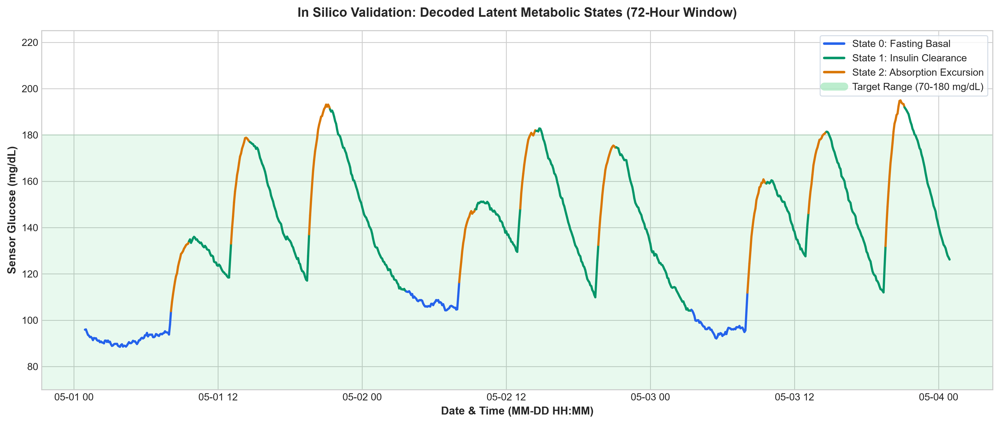
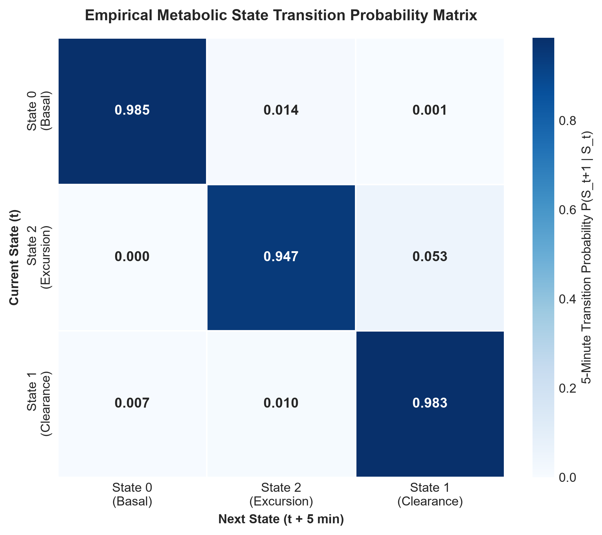

# 📈 Project C — In Silico Metabolic State Modeller (CGM Hidden Markov Model)

> **Can unsupervised machine learning recover latent pharmacokinetic states from continuous glucose telemetry?**
>
> An *in silico* methodological validation study evaluating unsupervised Gaussian Hidden Markov Models (HMMs) on Continuous Glucose Monitoring (CGM) telemetry. The pipeline simulates two-compartment pharmacokinetics, extracts velocity ($dG/dt$) and rolling volatility features, benchmarks state recovery against simulator ground truth ($\text{ARI} = 0.7751$), demonstrates a divergence between likelihood-based criteria (BIC) and compartment recovery (ARI), and documents an unexpected negative finding where incorporating Insulin-on-Board (IOB) degraded state discovery.

[](https://python.org)
[](https://hmmlearn.readthedocs.io/)
[](https://scikit-learn.org)
[](LICENSE)

---

## 1. Study Framing & Methodological Scope

> **Scope & Epistemic Boundary:** This project is an *in silico* methodological validation, not a physiological discovery study. Ground-truth states are compartments defined by the simulator's ordinary differential equations (ODEs) and threshold rules. A strong Adjusted Rand Index (ARI) demonstrates that the Gaussian HMM can recover known latent structure from continuous glucose signals alone—not that these compartments correspond directly to independently assayed human cellular biology.

Clinical CGM benchmark datasets (e.g., OhioT1DM) require formal Institutional Data Use Agreements (DUA; currently requested/pending). Project C establishes a verified pipeline architecture on stationary 5-minute telemetry ($88.5\text{--}210.5\text{ mg/dL}$, mean $132.8\text{ mg/dL}$, week-over-week drift $4.15\text{ mg/dL}$) containing three defined simulator compartments:
1. **`Fasting_Basal` (31.6% of simulated steps):** Steady baseline euglycemia ($98.9\text{ mg/dL}$, volatility $1.00\text{ mg/dL}$).
2. **`Absorption_Spike` (18.3% of simulated steps):** Postprandial gut absorption driving positive velocity ($dG/dt = +0.622\text{ mg/dL/min}$, volatility $11.59\text{ mg/dL}$).
3. **`Insulin_Clearance` (50.1% of simulated steps):** Active post-peak insulin disposal driving downward recovery ($dG/dt = -0.181\text{ mg/dL/min}$, mean glucose $141.1\text{ mg/dL}$).

---

## 2. Key Scientific & Methodological Findings

### 1. Ground-Truth State Recovery ($\text{ARI} = 0.7751$)
Using continuous glucose features alone ($G_{\text{smooth}}$, $dG/dt$, $\sigma_{\text{1h}}$), an unsupervised 3-state Gaussian HMM recovered the simulator's latent compartments with an **Adjusted Rand Index of $\text{ARI} = 0.7751$**:
* **`Insulin_Clearance`:** $1,984 / 2,020 = \mathbf{98.2\%}$ sensitivity ($dG/dt = -0.181\text{ mg/dL/min}$).
* **`Absorption_Spike`:** $672 / 736 = \mathbf{91.3\%}$ sensitivity ($dG/dt = +0.622\text{ mg/dL/min}$).
* **`Fasting_Basal`:** $1,064 / 1,265 = \mathbf{84.1\%}$ sensitivity ($dG/dt = -0.028\text{ mg/dL/min}$).

| True Simulator State (Rows: $N_{\text{True}}$) | Decoded State 0 (Basal) | Decoded State 1 (Clearance) | Decoded State 2 (Excursion) | Sensitivity |
| :--- | :---: | :---: | :---: | :---: |
| **`Fasting_Basal` ($N=1,265$)** | **1,064** | 197 | 4 | **84.1%** |
| **`Insulin_Clearance` ($N=2,020$)** | 0 | **1,984** | 36 | **98.2%** |
| **`Absorption_Spike` ($N=736$)** | 14 | 50 | **672** | **91.3%** |

*(Note: Matrix rows sum to the simulator's true compartment counts; columns sum to decoded model assignments: State 0 = 1,078, State 1 = 2,231, State 2 = 712).*

---

### 2. Dual-Criterion Model Selection (BIC vs. Ground-Truth ARI)
Evaluating model complexity across $k \in [2, 6]$ states using multi-restart convergence (`n_inits=5`, `init_params="smc"`) revealed a clear methodological divergence between likelihood criteria and compartment recovery:
* **$k=2$:** $\text{BIC} = 21,700.3$ | $\text{ARI} = 0.3361$
* **$k=3$:** $\text{BIC} = 11,576.3$ | **$\text{ARI} = 0.7751$ (Optimal Biological Recovery)**
* **$k=4$:** $\text{BIC} = 7,939.2$ | $\text{ARI} = 0.5867$
* **$k=5$:** $\text{BIC} = 4,748.5$ | $\text{ARI} = 0.4465$
* **$k=6$:** $\text{BIC} = 3,209.5$ | $\text{ARI} = 0.4198$

**Methodological Finding:** BIC decreases monotonically across $k=2\text{--}6$, illustrating the tendency of likelihood-based information criteria to over-segment continuous time-series into redundant micro-states. In contrast, Ground-Truth ARI peaks at $k=3$, justifying three states as the optimal compartment representation.

---

### 3. Strongly Unidirectional Transition Structure
The unsupervised HMM recovered transition dynamics consistent with physiological meal progression:

┌─────────────────────────────────────────────────────────────┐
│                                                             │
│    ┌──────────────────┐               ┌──────────────────┐  │
└───►│  State 0: Basal  ├──────────────►│ State 2: Spikes  │  │
└────────┬─────────┘   P = 0.0139  └────────┬─────────┘  │
▲                                  │            │
P = 0.0067 │                                  │ P = 0.0534 │
│        ┌──────────────────┐      │            │
└────────┤ State 1: Clear.  │◄─────┘            │
└──────────────────┘                   │
│
Reverse Transitions:                                          │
• P(Clearance -> Excursion) = 0.0103                        │
• Direct P(Basal -> Clearance) = 0.0009                     │
└─────────────────────────────────────────────────────────────┘


The transition topology is strongly unidirectional; reverse transitions occur at under $1\%$ probability, matching the forward flow of digestion and clearance.

#### 5-Minute Transition Probability Matrix $P(S_{t+1} \mid S_t)$

| Current State ($S_t$) | Next: State 0 (Basal) | Next: State 2 (Excursion) | Next: State 1 (Clearance) |
| :--- | :---: | :---: | :---: |
| **State 0 (Basal)** | **0.9852** | 0.0139 | 0.0009 |
| **State 2 (Excursion)** | 0.0000 | **0.9466** | 0.0534 |
| **State 1 (Clearance)** | 0.0067 | 0.0103 | **0.9830** |

---

### 4. Dwell Times Consistent with First-Order Markov Memory ($N=1,000$)
Empirical dwell times benchmarked against 1,000 first-order Markov surrogate sequences:
* **State 0 (Fasting Basal):** Median = **282.5 mins** ($\text{IQR} = 111.3\text{ min}$, Surrogate $p = 0.294$).
* **State 1 (Insulin Clearance):** Median = **300.0 mins** ($\text{IQR} = 127.5\text{ min}$, Surrogate $p = 0.061$).
* **State 2 (Absorption Excursion):** Median = **95.0 mins** ($\text{IQR} = 13.8\text{ min}$, Surrogate $p = 0.050$).

**Surrogate Null Finding:** All empirical dwell distributions are consistent with first-order Markov simulations ($p \ge 0.05$). State persistence is fully parameterized by transition matrix inertia without higher-order non-Markovian memory.

---

### 5. Negative Finding on Insulin-on-Board (IOB) Feature Fusion
* **CGM-Only Features ($G_{\text{smooth}}$, $dG/dt$, $\sigma_{\text{1h}}$):** $\text{ARI} = 0.7751$
* **CGM + Insulin-on-Board (IOB):** $\text{ARI} = 0.6920$ ($\Delta = -0.0831$)
* **Mechanism:** Adding zero-inflated, monotonically decaying IOB degraded unsupervised recovery. The pharmacokinetic decay curve dominated feature variance, pulling the HMM toward segmenting by insulin decay phase rather than continuous glucose trajectory dynamics.

---

## 3. Clinical Risk Metrics & Recovery Dynamics

### Postprandial Excursion Recovery Dynamics
* **Logged Meals in Trace:** 38 events across 14 days.
* **High-Velocity Excursions Detected:** 15 distinct events (**39.5% sensitivity**).
  * *Sensitivity Interpretation:* The HMM isolates clinically significant high-velocity excursions; smaller meals produce gradual glycemic rises that are absorbed directly into the clearance state.
* **Resolution to Basal:** 14 events completed full return (**93.3% completion rate**).
* **Median Time to Basal Recovery:** **6.33 hours** ($\text{IQR} = 0.81\text{ hours}$).

### State-Conditioned ADA Clinical Risk Breakdown

| Decoded State (Assigned Samples) | Samples | TBR ($<70\text{ mg/dL}$) % | TIR ($70\text{--}180\text{ mg/dL}$) % | TAR ($>180\text{ mg/dL}$) % | CV (%) |
| :--- | :---: | :---: | :---: | :---: | :---: |
| **State 0: Fasting Basal** | 1,078 | 0.0% | **100.0%** | 0.0% | 4.8% |
| **State 1: Insulin Clearance** | 2,231 | 0.0% | **93.5%** | 6.5% | 16.0% |
| **State 2: Absorption Excursion** | 712 | 0.0% | **80.6%** | 19.4% | 14.6% |

*(Note: Row counts reflect decoded state assignments; compare to Section 2.1 for ground-truth counts).*

---

## 4. Visualisations

### Trajectory Timeline (Decoded States)

*Figure 1: 72-hour continuous CGM trajectory color-coded by decoded latent state across the target range ($70\text{--}180\text{ mg/dL}$). Blue captures fasting baseline euglycemia, amber highlights meal absorption spikes, and green tracks insulin-mediated clearance.*

### State Transition Probability Heatmap

*Figure 2: Empirical Markov transition probability matrix ordered by semantic progression ($\text{Basal} \to \text{Excursion} \to \text{Clearance}$).*

---

## 5. Methodological Limitations

1. **Threshold-Defined In Silico Ground Truth:** Ground-truth labels reflect the simulator's pharmacokinetic ODE compartments and velocity thresholds rather than directly assayed human biological states.
2. **Deterministic Pharmacokinetic Regularity:** The narrow recovery IQR ($0.81\text{ hours}$) stems from regular simulated meal dosing and deterministic ODE kinetics; real clinical CGM exhibits substantially higher physiological variability.
3. **Single Simulated Cohort Trace:** Results evaluate a single 14-day simulated metabolic trajectory.
4. **Clinical Dataset Access:** Real-world validation on the OhioT1DM clinical CGM dataset is pending Institutional Data Use Agreement (DUA) credentialing. The ingestion pipeline matches the schema required for clinical XML ingestion upon approval.

---

## 6. Execution Guide

### Installation
```bash
git clone [https://github.com/your-username/metabolic-ai-portfolio.git](https://github.com/your-username/metabolic-ai-portfolio.git)
cd metabolic-ai-portfolio/project-c-state-modeller
pip install -r requirements.txt
Reproduce Analysis End-to-End
Bash
# 1. Generate stationary in silico telemetry
python src/load_simulation.py

# 2. Extract velocity and volatility features
python src/extract_features.py

# 3. Fit Gaussian HMM with multi-restart convergence & dual model selection
python src/fit_hmm.py

# 4. Evaluate Markov surrogate dwell times & recovery dynamics
python src/evaluate_states.py

# 5. Render state trajectory plots and heatmaps
python src/plot_trajectories.py

# 6. Run automated unit test suite
pytest tests/test_project_c.py